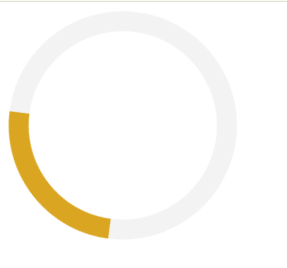

## 🚀 How to Run

1. Download or clone the repository.
2. Open the project folder.
3. Open `index.html` in your web browser.

## 📚 Concepts Practiced

- CSS Borders
- Border Radius
- CSS Animations
- Keyframes
- Transform Rotate
- Basic Web Design

## 🎯 Learning Outcome

Through this project, I learned how to:
- Create circular shapes using CSS.
- Apply animations with `@keyframes`.
- Use CSS transforms for smooth rotation effects.
- Build simple UI components without JavaScript.

## 📸 Preview

